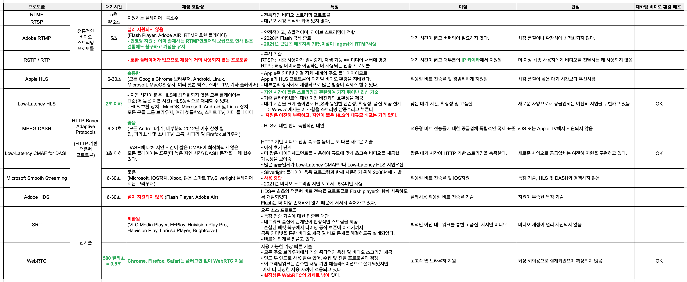

# What is Video Encoding ?
```
The process

- of converting
    - Raw video → a digital format ⇒ compatible with many devices
- GB → MB
- Essential to live streaming + quick delivery, playback
- Can occur
    
    Within 
    
    - browser
    - Mobile app
    - IP Camera
    - Software : Vmix, Wirecast, OBS Studio
    - Stand-alone appliance
- To compress ← use video and audio codec
    
    Raw video → MB
    
- encoding = the process of compressor
- Codec = the means for doing so
```

# What is Codec ?
```
Codec 

- a video compression technology
    
    Videos - - - - - -> a streamable size
    

                         Shrink 수축

- Tightly compress bulky streams for delivery storage
- H.264
- AVC
- AAC (audio)
```

# Streamin Protocols


# Ingest and Transcoding
```
- 스트림을 다양한 코덱, 비트 전송률, 해상도 및 파일 컨테이너로 트랜스 코딩 해야한다.
- 트랜스 코딩을 통해 방송사는 시청자의 연결이나 하드웨어에 관계없이 거의 모든 장치에 연결이 가능하다.
- 트랜스 코딩이 완료되면 원본 스트림의 여러 변환이 전달되기 위해 출발한다.
```

# Transmuxing, Transcoding, Transizing, Transrating
```
다양한 장치 및 연결 속도에 걸쳐 시청 경험을 최적화하기 위해 방송사는 종종 스트림이 미디어 서버를 통과할 때 스트림을 트랜스먹싱, 트랜스 코딩, 트랜사이지으 트랜스 레이팅 하도록 선택합니다.

Transmuxing
    - 압축된 오디오 및 비디오를 가져와 다른 컨테이너 형식으로 다시 패키징 합니다.
    - 이를 통해 실제 파일을 조작하지 않고도 다양한 프로토콜을 통해 전달 할 수 있습니다.
    - 워드 문서를 pdf로 또는 그 반대로 변환하는 것과 같은 트랜스 먹싱을 생각해 볼 수 있다.
Transcoding
    - 압축/인코딩된 파일을 가져와 압축을 풀고 디코딩하여 어떤 방식으로든 변경하는 것을 가리키는 포괄적인 용어이다.
    - 그런 다음 조작된 파일은 전달을 위해 다시 압축 된다. 트랜스 사이징, 트랜스 레이팅 모두 트랜스 코딩의 하위 범주이다.
Transrating
    - 다양한 연결 속도를 수용하기 위해 압축 해제된 파일의 비트 전송률을 변경한다.
    - 여기에는 프레임 속도, 해상도 변경이 포함 될 수 있다.
Transrating
    - 다양한 화면에 맞게 비디오 프레임 크기 또는 해상도를 조정한다.

→ 하나의 비트 전송률로 하나의 라이브 스트림을 생성하는 대신 트랜스코딩을 사용하면 서로 다른 비트 전송률과 해상도로 여러 스트림을 생성할 수 있다.

 = 이를 바로 든 시청자의 화면 크기와 인터넷 속도에 맞게 동적으로 조정될 수 있는 적응형 비트 전송률 (ABR) 이라 한다.
```
